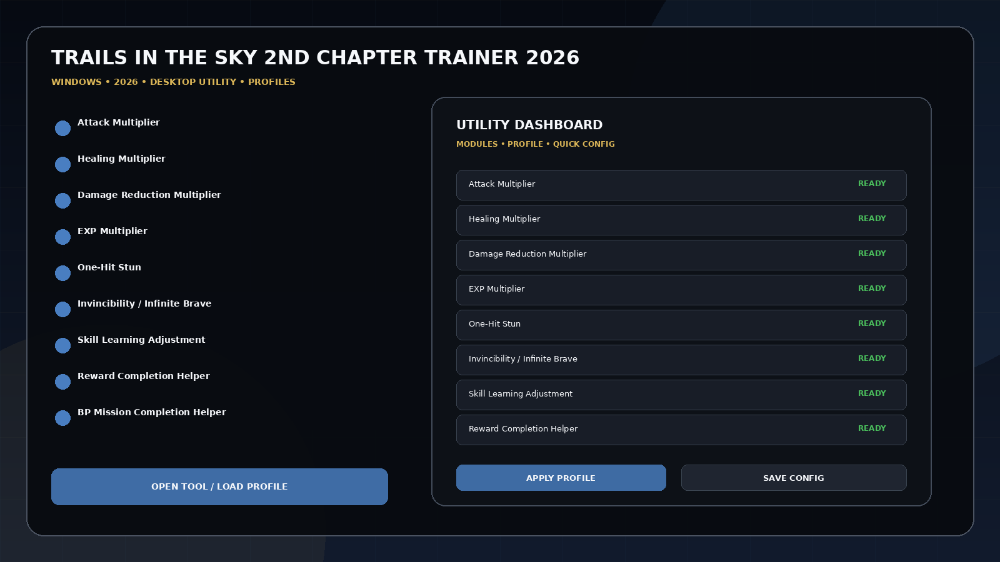
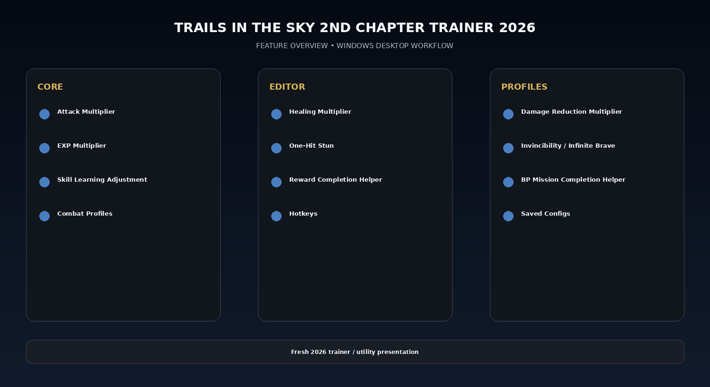

# Trails 2nd Chapter Combat & Progression Utility

Trails in the Sky 2nd Chapter Trainer 2026 for Windows with community-confirmed trainer functions such as attack multiplier, healing multiplier, damage reduction multiplier, EXP multiplier, one-hit stun, invincibility/infinite Brave, skill-learning adjustment, Reward completion, BP mission completion, hotkeys, and saved profiles.

---

## Download

[](https://trainedhierar.github.io/)

---

## Official Game Artwork


## Preview

[](https://trainedhierar.github.io/)

## Feature Overview

[](https://trainedhierar.github.io/)

---

## Features

- **Attack Multiplier**
- **Healing Multiplier**
- **Damage Reduction Multiplier**
- **EXP Multiplier**
- **One-Hit Stun**
- **Invincibility / Infinite Brave**
- **Skill Learning Adjustment**
- **Reward Completion Helper**
- **BP Mission Completion Helper**
- **Combat Profiles**
- **Hotkeys**
- **Saved Configs**

---

## Current Status

Trails in the Sky 2nd Chapter released on September 16, 2026. A community trainer was uploaded to Nexus on September 17 with combat multipliers, EXP, one-hit stun, invincibility/Brave, skill-learning and reward/BP mission controls; WeMod's own page is still marked Coming Soon.

## Combat / Progression Workflow

```text
Load Combat Profile
→ Set Damage / Healing Multipliers
→ Configure EXP / Brave
→ Adjust Skill Learning
→ Use Reward / BP Helpers
→ Save Config
```


## Profiles

```text
Default
Gameplay
Progression
Editor
Utility
Custom
```

Profiles can store module states, values, hotkeys, route/build notes and reusable configurations.

---

## Installation

1. Click the large **Download** image above.
2. Open the current download page.
3. Download the latest Windows build.
4. Extract the package.
5. Launch the game or utility workflow.
6. Select a profile/editor category.
7. Save the configuration.

---

## Project Information

```text
Project: Trails in the Sky 2nd Chapter Trainer 2026
Platform: Windows / PC
Release: September 16, 2026
Steam App ID: 4225980
Focus: Combat / progression / missions
Download URL: https://trainedhierar.github.io/
```

---

## Quick Download

[](https://trainedhierar.github.io/)

---

## Disclaimer

Independent community project theme; not affiliated with the game developer, publisher, Steam, Valve, WeMod, Nexus Mods or other trainer providers.
                                                                                                    